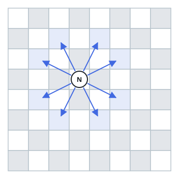

# Even Number of Knight Moves

## Description

You are given two integer arrays `start` and `target`, where each array is of
the form `[x, y]` representing a cell on a standard `8 x 8` chessboard.

Return `true` if a knight can move from `start` to `target` in an even number
of moves. Otherwise, return `false`.

Note: A valid knight move consists of moving two squares in one direction and
one square perpendicular to it.



### Example 1

```text
Input: start = [1,1], target = [2,2]
Output: true
Explanation:
    One possible sequence of moves is
    (1, 1) -> (3, 2) -> (2, 4) -> (4, 3) -> (2, 2).

    The knight reaches the target in 4 moves, which is even.
    Thus, the answer is true.
```

### Example 2

```text
Input: start = [4,5], target = [6,6]
Output: false
Explanation: It is impossible to reach target = [6, 6] from start = [4, 5]
in an even number of moves. Thus, the answer is false.
```

### Constraints

- `start.length == target.length == 2`
- `0 <= start[i], target[i] <= 7`

## Hints

### Hint 1

Color the chessboard like a standard chessboard using the parity of
`x + y`.

### Hint 2

Every knight move changes the color of the current cell. Therefore, after an
even number of moves, the knight must be on a cell of the same color as the
starting cell.

### Hint 3

Since every cell is reachable from every other cell on an `8 x 8` chessboard,
return whether `(start[0] + start[1]) % 2 == (target[0] + target[1]) % 2`.
