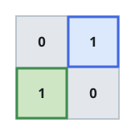
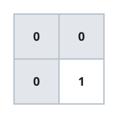

# Maximum Area of Two Non-Overlapping Square Submatrices

## Description

You are given a 2D integer matrix `mat` of size `m × n`, where:

- `mat[r][c] == 1` means the cell at row `r` and column `c` is usable.
- `mat[r][c] == 0` means it is not usable.

Your task is to find two submatrices that satisfy the following
conditions:

- Both submatrices must be squares of the same side length `k`.
- The two submatrices must not share any cell.
- Each submatrix can only cover cells where `mat[r][c] == 1`.

Return the maximum possible area of each of the two squares. If it is
not possible to choose two such squares, return 0.

### Example 1


```text
Input: mat = [[1,1,1,0],[1,1,1,1],[0,0,1,1]]
Output: 4
Explanation:
The largest equal non-overlapping squares have side length k = 2 with area 4.
- First square starts at top-left (0, 0) and covers cells (0, 0), (0, 1), (1, 0), and (1, 1).
- Second square starts at top-left (1, 2) and covers cells (1, 2), (1, 3), (2, 2), and (2, 3).
Thus, the answer is 4.
```

### Example 2



```text
Input: mat = [[0,1],[1,0]]
Output: 1
Explanation:
The largest equal non-overlapping squares have side length k = 1 with area 1.
- First square starts at top-left (0, 1) and covers cell (0, 1).
- Second square starts at top-left (1, 0) and covers cell (1, 0).
Thus, the answer is 1.
```

### Example 3



```text
Input: mat = [[0,0],[0,1]]
Output: 0
Explanation:
There is only one usable cell, so it is impossible to choose two non-overlapping squares. Thus, the answer is 0.
```

### Constraints

- `mat.length == m`
- `mat[i].length == n`
- `1 <= m, n <= 500`
- `mat[i][j]` is either `0` or `1`.

## Hints

### Hint 1

Binary search for the maximum side length k. If two valid squares of side length k exist, two valid squares of every smaller side length also exist.

### Hint 2

Build a 2D prefix sum so that you can determine in constant time whether every cell in a given square is usable.

### Hint 3

For a fixed k, record the minimum and maximum row and column among the top-left corners of all valid squares. Two of them can be disjoint if the difference between the maximum and minimum row is at least k, or the corresponding column difference is at least k.
