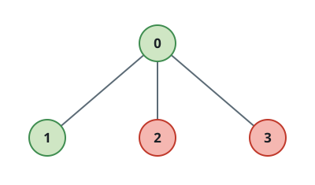

# Total Sum of Interaction Cost in Tree Groups II

## Description

You are given an integer `n` and an undirected tree rooted at node 0 with `n`
nodes numbered from 0 to `n - 1`. The tree is represented by a 2D integer
array `edges` of length `n - 1`, where `edges[i] = [ui, vi]` indicates an
undirected edge between nodes `ui` and `vi`.

You are also given an integer array `group` of length `n`, where `group[i]`
denotes the group label assigned to node `i`.

- Two nodes `u` and `v` belong to the same group if and only if
  `group[u] == group[v]`.
- The interaction cost between two nodes is the shortest distance between
  them in the tree.

Return the sum of interaction costs over all pairs of node indices `(u, v)`
such that `0 <= u < v < n` and `group[u] == group[v]`.

The shortest distance between two nodes is the number of edges on the unique
path connecting them in the tree.

### Example 1


```text
Input: n = 3, edges = [[0,1],[1,2]], group = [1,1,1]
Output: 4
Explanation: All nodes belong to group 1. The interaction costs between the
pairs of nodes are:

Nodes [0, 1]: 1
Nodes [1, 2]: 1
Nodes [0, 2]: 2

Thus, the total interaction cost is 1 + 1 + 2 = 4.
```

### Example 2


```text
Input: n = 3, edges = [[0,1],[1,2]], group = [3,2,3]
Output: 2
Explanation: Nodes 0 and 2 belong to group 3. The interaction cost between
this pair is 2.
Node 1 belongs to a different group and forms no valid pair. Therefore, the
total interaction cost is 2.
```

### Example 3



```text
Input: n = 4, edges = [[0,1],[0,2],[0,3]], group = [1,1,4,4]
Output: 3
Explanation: Nodes belonging to the same groups and their interaction costs
are:

Group 1: Nodes [0, 1]: 1
Group 4: Nodes [2, 3]: 2

Thus, the total interaction cost is 1 + 2 = 3.
```

### Example 4

```text
Input: n = 2, edges = [[0,1]], group = [1,2]
Output: 0
Explanation: All nodes belong to different groups and there are no valid
pairs. Therefore, the total interaction cost is 0.
```

### Constraints

- `1 <= n <= 10⁵`
- `edges.length == n - 1`
- `edges[i] = [ui, vi]`
- `0 <= ui, vi <= n - 1`
- `group.length == n`
- `1 <= group[i] <= n`
- The input is generated such that `edges` represents a valid tree.

## Hints

### Hint 1

(Virtual Tree) For each edge, removing it partitions the tree into two components. If one component contains x nodes of some group and the entire tree contains k nodes of that group, the edge contributes x * (k - x) to the answer.

### Hint 2

(Virtual Tree) Preprocess depths, DFS entry times, and lowest common ancestors. For each group, sort its nodes by DFS entry time and construct their virtual tree by adding the LCAs of adjacent nodes.

### Hint 3

(Virtual Tree) For a virtual-tree edge from p to v, use depth[v] - depth[p] as its length. If the virtual subtree contains x nodes from the group, its contribution is x * (k - x) * (depth[v] - depth[p]).

### Hint 4

(Small-to-Large Merging) For every subtree, maintain for each group both its node count and the sum of distances from those nodes to the subtree root.

### Hint 5

(Small-to-Large Merging) When merging two maps at a node, two entries (cnt1, sum1) and (cnt2, sum2) for the same group contribute cnt1 * sum2 + cnt2 * sum1. Always merge the smaller map into the larger one.
