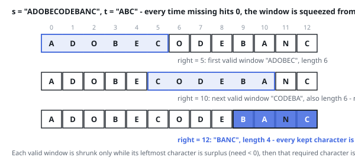

# Solutions — Minimum Window Substring

Two searches for the same shortest piece, differing in what they choose to
know. The binary search fixes the length first — is there a covering window
of size `L` at all? — and because that answer flips only from no to yes as
`L` grows, halving the range of lengths homes in on the shortest one, paying
a full sweep of `s` per probe for never having to decide whether a window
should grow or shrink. The sliding window decides on the fly: it extends the
right end until the debts to `t` clear, then shrinks from the left while
coverage survives, and both ends travel the string once.

## Binary Search on the Length

Ask a coarser question first: does any window of length `L` cover `t` at all?
The answer is monotone in `L`, because a covering window of length `L` sits
inside a covering window of length `L + 1` — extend it by one character on
either side, and one of the two extensions always fits — and extra characters
never break coverage. So the truth is false below some length `L*` and true
from `L*` upward: exactly the shape binary search needs. Search the length,
and the position comes out in the wash.

Each probe slides one window of the candidate length across `s`, left to
right, keeping a count per demanded letter plus `below`, the number of
letters still short of quota — coverage is the single test `below == 0`. A
letter's arrival takes its count from quota-minus-one to quota exactly once,
and that step alone lowers `below`; a departure from quota to quota-minus-one
raises it back; surplus copies and letters foreign to `t` never touch the
tally. The probe reports the first covering start it meets, and at the
minimal surviving length that is the same leftmost shortest cover the
shrinking sweep settles on.

Follow `s = "BEFFCDEAAFBAD"`, `t = "BFD"`: lengths run from 3 to 13. The probe
at 8 finds the prefix `BEFFCDEA` already covers, so the answer is at most 8;
the probe at 5 finds `AFBAD`; the probe at 3 finds nothing — no three
consecutive letters hold B, F and D together — and the final probe at 4 stops
on `FBAD` at index 9.

The books are alphabet-sized, so space stays constant. Time is one initial
tally of `t` plus a sweep of `s` for each of the ~log n probes — a
logarithmic factor over the sliding window, the price of settling the length
before ever looking at positions.

**Complexity:** `O(m + n log n)` time, `O(1)` space.

## Sliding Window with a Deficit Counter

The window is managed with two quantities: `need[c]`, how many more copies
of character `c` the window still owes (initialized to `t`'s counts), and
`missing`, the total number of owed character instances across all letters.
The pair makes coverage testable in `O(1)`: when `missing` reaches `0`, every
character of `t`, duplicates included, is inside the window. As `right`
admits a character, `need[ch] > 0` means this occurrence is genuinely still
required, so `missing` decrements; then `need[ch]` decrements regardless,
which drives unneeded letters and surplus copies negative without ever
touching `missing`. Characters absent from `t` simply slide through with a
negative entry.

Each time `missing` hits `0`, the window `[left, right]` is valid, and the
code shrinks it from the left while `need[s[left]] < 0` — that is, while the
leftmost character is surplus — returning each released copy to the budget.
The shrink stops at the first position whose character sits at exactly its
quota, which is the tightest valid window ending at this `right`; it is
recorded if it beats the best seen. Then the code deliberately evicts that
leftmost required character (`need[s[left]] += 1`, `missing += 1`,
`left += 1`), leaving the search owing exactly one instance so scanning can
continue for the next completion. `left` and `right` each only move forward,
so all growing and shrinking across the whole run telescopes to linear work
on top of the `O(n)` tally of `t`.

Degenerate inputs are handled up front: an empty `t`, or a `t` longer than
`s`, returns `""` immediately, and if no window ever reaches `missing == 0`
the sentinel `best_len` stays infinite and `""` is returned at the end. The
counter dictionary is bounded by the alphabet of the two strings (at most 52
distinct English letters), so it never grows with input size.

**Complexity:** `O(m + n)` time, `O(1)` space.
