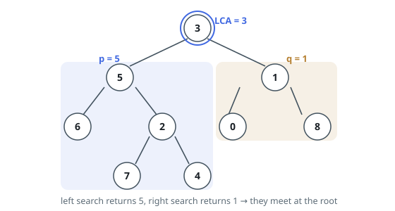

# Solutions — Lowest Common Ancestor of a Binary Tree

Two ways of finding where two root-to-target chains meet. One runs the tree
backwards: record every node's parent in one walk, then the chains become
list walks from each target upward, and the deepest shared ancestor is the
first entry of one chain seen from the other. The other is a single
recursive pass that reports the chains themselves — a subtree hands back the
target it ran into, and the first node whose two children both have something
to say is the meeting point.

## Parent Pointers

A node knows its children, not its parent — but parents are the direction the
answer lives in, because a shared ancestor is a node on both upward chains.
So the first move is to invert the tree: one stack-driven walk from the root
that records, for every node it reaches, the value of that node's parent.
Values are unique, so a value identifies its node, and the parent table is the
whole tree re-pointed upward; the root, with no parent, is simply absent from
it.

With upward edges in hand, each target's ancestry becomes a plain list walk.
Start at `p` and follow parent links to the root, collecting values into a
set — that set is exactly the nodes whose subtrees contain `p`, `p` itself
included, since a subtree contains its own root. Then start at `q` and climb:
the first value found in the set is a node containing both, and no deeper node
of `q`'s chain can be one, because every value below the meeting point on
`q`'s side was absent from `p`'s chain. The above-the-other shape needs no
special case either: when `q` sits above `p`, `q` is a member of `p`'s chain
and the climb stops on its first step; when `p` sits above `q`, the set runs
out exactly at `p`.

Both passes are linear, and the stack never holds more than the tree is wide.
What is spent is memory proportional to the tree — the parent table holds an
entry per node besides the root, and the ancestry set can hold all of them —
which is exactly what the recursive form declines to spend: it keeps only the
call stack, one frame per level, and re-derives the chains on the way up.

**Complexity:** `O(n)` time, `O(n)` space.

## Recursive Subtree Search

Without the search-tree ordering, a node's value says nothing about which subtree holds the targets, so the whole subtree must be searched. The recursion answers a slightly different question per subtree: does it contain `p` or `q`? It returns the found target node itself, or `None` when neither is present. A node that is `None`, or whose value equals `p` or `q`, is returned immediately — a node counts as a descendant of itself, so matching is itself a successful find.

The LCA reveals itself at the join. At each internal node the search recurses into both children; if the left and right searches each return a (different) target node, the two targets meet at this node for the first time — every node below was checked and saw at most one target — so this node is the lowest common ancestor and is returned upward. Otherwise the non-`None` result (if any) is propagated. The immediate return on a value match is what makes the ancestor case work: when one target is an ancestor of the other, the ancestor is returned from its subtree without ever searching below it, and it wins the propagation against any `None` side.

Because the two targets are guaranteed to exist and be distinct, the root call always returns a node whose value is the answer. Each node is visited at most once, and the recursion stack depth equals the tree height, which on a skewed tree of 10⁵ nodes can reach `n` — the price of the recursive formulation.

**Complexity:** `O(n)` time, `O(h)` space.
