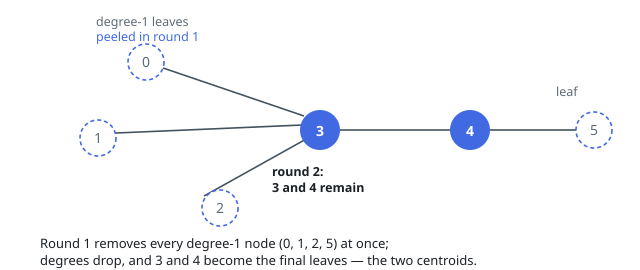

# Solutions — Minimum Height Trees

Two ways of standing at the tree's middle. The height of a root is decided
by the longest downward walk from it, and that walk is half of some
diameter — so the minimizing roots are exactly the middles of the tree's
longest path. Both solutions use that fact; they differ in how they reach
the middle. One shrinks the whole tree around it, layer by layer from the
leaves inward, never naming the longest path at all. The other finds the
longest path outright — two breadth-first sweeps suffice — and reads its
middle off by position.

## Iterative Leaf Peeling (Centroid Trimming)

The root of a minimum height tree is a centroid of the tree — a node in the "middle" of the longest path. Rather than trying every root (an all-pairs BFS costing quadratic time), the solution peels the tree from the outside in: it repeatedly deletes all current leaves at once, the way topological sort removes zero-indegree nodes. Each peeling layer strictly shortens every longest root-to-leaf distance from the remaining core, so the process converges on the center.

The code builds an adjacency list and a degree array, seeds a queue with all degree-1 nodes, and loops while more than two nodes remain. Each round pops exactly the current layer: every leaf leaves the queue, `remaining` drops by one per leaf, and each leaf decrements its neighbors' degrees, enqueuing any neighbor that thereby becomes a leaf. Degrees are never reset to zero for the popped leaf itself, which is harmless — a popped node is never examined again.

Why one or two nodes, never more: the tree's diameter is realized along some path, and rooting at the path's middle node minimizes height; when the diameter has even edge count there is a unique middle node, and when odd there are two adjacent middles, both achieving the same minimum. The peeling stops precisely when the remaining core is that middle. The `n <= 2` shortcut returns all nodes immediately, since a one- or two-node tree is its own center (and the general loop would mishandle a two-node tree where both nodes are each other's leaves).

The final one or two survivors are sorted and returned as the MHT roots. Every node and edge is touched a constant number of times across all rounds, so a single linear pass over the graph suffices.

**Complexity:** `O(n)` time, `O(n)` space.

## Double BFS

Name the diameter, then split it. In a tree, the node farthest from any
arbitrary start is always one _end_ of a longest path — every step away
from the start can only be extended, never shorted, along the unique
routes — so a first BFS from node `0` lands on one end `u`, and a second
BFS from `u`, which records each discovered node's parent, lands on the
other end `v` at distance `d`: the diameter. Climbing `v` back to `u`
through the discovery parents reconstructs that path in reverse, `d + 1`
nodes long.

The minimal-height roots are the path's middle, by position: an even `d`
puts a single node `d / 2` steps from both ends (Example 1's path
`0-1-2-3-4-5-6`, `d = 6`, middle `3`), an odd `d` leaves two adjacent
nodes straddling it, both at the same minimal height (Example 3's single
edge gives `[0, 1]`). No shortcut is needed for tiny trees: a one-node tree
has `d = 0` and the walk's lone node is its own middle. Both BFS sweeps
read each edge twice and the climb is one pass down the path, so the whole
answer costs two traversals plus the adjacency storage.

**Complexity:** `O(n)` time, `O(n)` space.
