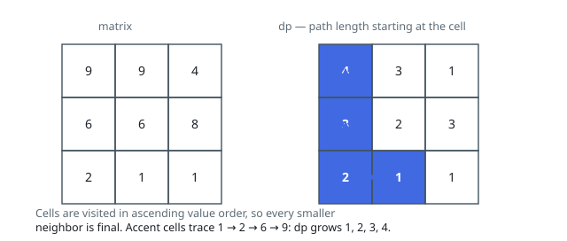

# Solutions — Longest Increasing Path in a Matrix

Every legal step climbs to a strictly larger value, so no walk can return
to a cell it has left — the grid is a directed acyclic graph whose edges
point from each cell to its larger four-direction neighbours, and the task
is longest path on that DAG. Both solutions memoize the same quantity —
`dp[i][j]`, the length of the longest ascending walk starting at `(i, j)` —
and both trust strict ascent to rule out cycles, needing no visited marks.
What separates them is how the DAG gets processed. One refuses to traverse
it at all: it sorts the cells by value, and ascending value order is a
topological order for free. The other explores it depth-first from each
cell, letting each walk's answer fall out of the walks it continues into —
with the call stack spelled out explicitly rather than borrowed from the
language runtime.

## Value-Ordered DP over the Cell DAG

Since a path must strictly increase at every step, following any path always moves to a strictly larger value — the matrix cells form a directed acyclic graph whose edges point from each cell to its larger four-directional neighbors. Acyclicity means the longest-path problem on this DAG can be solved by evaluating cells in topological order, and here a valid topological order is simply ascending value order.

The solution sorts all cells by value and allocates `dp[i][j]`, the length of the longest increasing path starting at cell `(i, j)`, initialized to 1 for the single-cell path. It then visits cells from smallest value to largest; when a cell is processed, every strictly smaller neighbor is guaranteed already final (it appears earlier in the sorted order), so `dp[i][j]` is just 1 plus the maximum `dp` over those smaller neighbors, and the running best is updated. Because the transition requires `matrix[ni][nj] < matrix[i][j]` strictly, equal-valued neighbors never link, which enforces strict increase and also makes the relative order of equal-valued cells in the sort irrelevant — none of them reads the others.

This bottom-up formulation replaces the memoized DFS one often sees: the sort plays the role of the recursion's memo, but with no recursion depth and no visited bookkeeping. It also handles plateaus and saddles of equal values correctly, since a plateau contributes no edges at all.

Edge cases: a 1×1 matrix returns 1 (the sort visits the one cell, `dp` stays 1); an empty guard returns 0 up front. Sorting `m · n` cells dominates the two linear sweeps over the grid, and the DP table plus sorted list account for the space.

**Complexity:** `O(mn log(mn))` time, `O(mn)` space.

## Memoized DFS with an Explicit Stack

The other route through the DAG: start a walk at a cell and follow actual
edges, one at a time. Standing on `(i, j)`, the longest ascending walk
leaving it is `1 + max` over the walks leaving each strictly larger
neighbour — a definition that recurses, so the natural shape is a
depth-first search that asks the question of every cell it reaches and
caches the answer in `memo`. Once any search has fixed `memo[i][j]`, no
later visitor re-walks that ground; a 200-cell column or a 2500-cell
serpentine grid is traversed once, not per start cell.

The recursion is carried on an explicit stack of frames — `(row, column,
next direction)` — rather than the language's call stack, so every port
runs identically regardless of a language's recursion limits: a grid whose
entire population forms one strictly ascending path is a 40 000-deep
recursion in the naive form. A frame first visits itself (`memo = 1`, the
walk of the cell alone), then tries its four directions in turn; when it
meets a larger neighbour whose memo is already final it absorbs
`memo + 1` on the spot, and when the neighbour is still virgin it descends,
pushing a frame. The fourth direction exhausted, the frame's own value is
final: it pops, offers `memo + 1` to the frame it descended from, and
feeds the running maximum. Pushing only virgin cells is what keeps each
cell on the stack at most once — a frame's larger neighbours can never be
its own ancestors, since ancestors are strictly smaller, so any non-virgin
neighbour's memo is genuinely finished.

Same memo table, same strict-`>` edge test, same answer as the sorted
sweep — arrived at by walking the DAG instead of ordering it. The stack
and the memo are the whole footprint; each cell is pushed once and each of
its four directions examined once.

**Complexity:** `O(mn)` time, `O(mn)` space.
