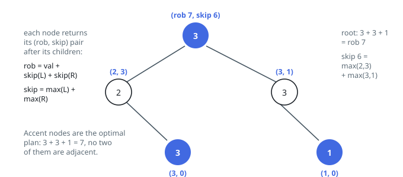

# Solutions — House Robber III

The rule binds a node only to its parent and its children, so both solutions
here rest on the same two-number state per subtree: the best total when its
root is taken, and the best when the root is barred. What separates them is
who does the remembering. One asks each question on demand, in whatever order
the questions arrive, and leaves a memo table to answer repeats. The other
never states the question twice — a single post-order pass carries both
numbers home in the same return.

## Memoized Recursion

This method declines to schedule the questions and instead makes each
one answerable on its own. `take(node)` asks for the best total in the
subtree under a plan that chooses `node`; `skip(node)` asks for the best under
a plan that bars it. `take` is trivial once the children are barred —
`node.val + skip(left) + skip(right)` — and `skip` lets each child do its
better thing — `max(take(child), skip(child))` per side. The root's answer is
the better of its two questions.

Left bare, these questions are dangerous. Answering `take(node)` needs the
children's `skip` values; answering `skip(node)` needs both of each child's
values; and nothing stops the same subtree from being asked — and re-walked —
at the top of several different question chains, which is the exponential
blowup the paired return avoids. The cure is the oldest one in the book: two
memo tables, one per question, keyed by the node. The first time a question
about a subtree is settled, its answer is recorded; every later asking is a
lookup. Each of the `2n` questions does `O(1)` work of its own, so the whole
computation is linear — but through bookkeeping rather than scheduling.

The tables are the entire difference in cost. Where the paired return held
nothing beyond the call stack, this one stores two entries per node, `O(n)`
memory, and it stores them for exactly as long as the computation runs. The
recursion depth is the same `O(h)`, one frame per question chain, and the
same example resolves identically: the leaves' answers are computed once,
reused by both parent questions, and the root still weighs 15 against 11.

**Complexity:** `O(n)` time, `O(n)` space for the two memo tables.

## Post-order tree DP with rob/skip pairs

Whether a house is worth robbing depends only on its immediate neighbors in the tree, so the optimal plan for a subtree is fully described by two numbers: the best loot if the subtree's root is robbed, and the best loot if it is skipped. Computing these two values for every node in a single post-order traversal solves the problem without any global state, because a parent's answer depends on its children's pairs and nothing else.

The recurrence is direct. Robbing a node forbids robbing both children, so `rob_here = node.val + left_skip + right_skip`. Skipping a node leaves each child free to do whichever is better for itself, so `skip_here = max(left_rob, left_skip) + max(right_rob, right_skip)`. The recursion bottoms out at `None` with the pair `(0, 0)`, and the final answer is the larger component of the root's pair. Returning a tuple per call is what makes this efficient: a naive solution that asked children separately for "best including grandchildren" and "best excluding this node" would recompute subtrees and blow up exponentially, whereas pairing the two values means each node's subtree is evaluated exactly once.

Edge cases are handled by the base case and the `max` wrappers: a single-node tree returns its own value, nodes with value 0 never distort the choice, and skewed (linked-list-like) trees simply deepen the recursion — with up to 10^4 nodes the recursion stack is bounded by the tree height, which is O(n) in the worst case.

**Complexity:** `O(n)` time, `O(h)` space for the recursion stack (where `h` is the tree height).
