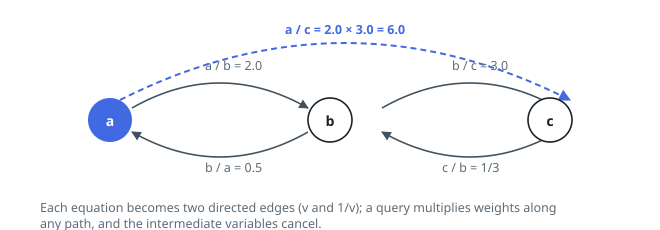

# Solutions — Evaluate Division

Both routes rest on the same pin: a stated ratio is reversible — `a / b = v`
read backwards is `b / a = 1 / v` — so the batch partitions the variables
into groups whose members' quotients are all fixed once any member's is. The
graph search answers each query by navigation, sweeping out of one variable
and multiplying arrow labels until the other turns up. The union-find does
that walking once, ahead of time: each stated ratio merges its two variables
into one rooted tree while every member keeps its quotient to the root, so a
query collapses to two root-relative values and one division.

## Weighted graph BFS

Each variable becomes a node and each equation `a / b = v` becomes a directed edge `a -> b` with weight `v`, plus a reverse edge `b -> a` with weight `1 / v` (division inverts when the direction flips). A query `C / D` is then a path-finding problem: multiplying the edge weights along any path from `C` to `D` telescopes to `C / D`, since every intermediate variable cancels between a weight and the inverse weight that follows it.

Each query runs an independent BFS from `C`, carrying the running product from the start. Neighbors are expanded with `product * weight`, a `seen` set prevents revisiting nodes (cycles would only multiply by round-trip products equal to 1), and the search returns early the moment `D` appears as a neighbor. Because the equations are guaranteed consistent, any path between the two nodes yields the same value, so the first path found is correct.

Unanswerable queries are filtered before the search: if either variable is absent from the graph the result is `-1.0` — this also covers `x / x` for an undefined `x`, while a known variable divided by itself returns `1.0` immediately without a traversal. If BFS exhausts the component without reaching `D`, the variables lie in different connected components and the query also returns `-1.0`.

**Complexity:** `O(Q·(V + E))` time (where `Q` is the number of queries, `V` the distinct variables, `E` the equations), `O(V + E)` space.

## Weighted union-find

A stated ratio is a merge order. Keep a forest in which every variable links
to a parent and carries `weight[x] = x / parent[x]`; the product along a
parent chain then telescopes to the member's ratio to its root — the very
quotient the BFS has to re-derive for every query. Folding `a / b = v` in
means hanging one root under the other: with `a = ratio_a · root_a` and
`b = ratio_b · root_b`, the identity `a = v · b` solves to
`root_b / root_a = ratio_a / (v · ratio_b)`, which becomes the hung root's
weight.

`find` walks up to the root while folding the chain into one quotient, then
re-hangs every node it visited directly on the root — path compression — so
the forest flattens itself as it is used, and union by size hangs the smaller
tree under the larger to keep the chains short in the first place. A ratio
whose two variables already share a root merely restates a fact the forest
encodes — the batch never contradicts itself — so the merge is skipped.

A query then costs two finds. A name absent from the forest answers `-1.0`,
which also covers an unknown divided by itself; two different roots mean no
stated ratio ever linked the groups (`m / v` in Example 2); and one shared
root hands back `ratio_c / ratio_d`, with a known variable over itself
falling out as `1.0` without any special case.

**Complexity:** `O((V + E + Q)·α(V))` time, where `V` counts the distinct
variables, `E` the stated values, `Q` the queries and `α` the inverse
Ackermann function, and `O(V)` space.
