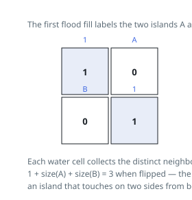

# Solutions — Making A Large Island

Both solutions rest on the same split: learn the islands first, then price
every `0` cell as one plus the summed sizes of the distinct islands pressed
against its four sides. They differ only in how the islands are learned. The
flood-fill stamps each island with a fresh id in one stack-driven walk — the
general-purpose way to traverse a component. The union-find variant exploits
the scan order instead: it never walks an island, it only ever joins each `1`
cell to the `1` cells above it and to its left, and a nearly-flat forest of
unions assembles the islands edge by edge.

## Island labeling plus per-zero merge

The flip can only glue together islands that already exist, so the first pass labels every 4-connected group of 1s with a distinct color using an iterative flood fill and records each label's size. The label grid starts at 0 for water/unvisited, and each flood marks its cells as it counts them, so every island is discovered exactly once.

The answer is then the best of two cases. Flipping some 0 cell yields `1` plus the sizes of the distinct islands touching it on the four sides; not flipping anything yields the largest existing island, which is also the correct answer for an all-1s grid where no 0 exists to flip. Initializing `best` from the island sizes covers the second case even when there are no 0 cells at all.

For each water cell the code collects the labels of occupied neighbors into a set before summing. The set is the crucial detail: one island can touch the same 0 cell on two or more sides (for example wrapping around a corner), and without deduplication its size would be added twice and overstate the merged area. Since there are at most four neighbors, the set work per cell is constant, and the whole scan stays linear in the grid.

**Complexity:** `O(n^2)` time, `O(n^2)` space.

## Union the islands, then price every empty cell

The pricing half of the plan does not care how the islands were learned, only
that each cell can name the island it belongs to and each island can report
its size. Union-find supplies both from a different direction: instead of
walking each island once with a stack, it never walks an island at all.

The first pass scans the matrix in row-major order and keeps a disjoint-set
forest over the cells. A `1` cell arriving at row `i`, column `j` needs no
introduction to its whole island — the cells above it and to its left are
already in the forest — so uniting with whichever of those two is also a `1`
connects the island edge by edge. Every `find` flattens the path it walked and
every union hangs the smaller root under the larger, so the forest stays
nearly flat and each operation costs almost constant time. The component size
lives at the root, so the size table of the first solution is not built
separately here — it is the forest itself.

The second pass is the pricing pass again, unchanged in structure. Every `0`
cell collects the roots of its occupied neighbours into a small set, sums the
sizes of those roots, and adds one for itself. Only the dedup key changes:
where the first solution compared stamped colours, this one compares
`find`-results, and two neighbours belonging to one island report one root.
Example 2's corner island touching the centre cell from above and from the
left is therefore still counted once, scoring 4 rather than 7. The running
maximum is again seeded with the largest existing island, which is what a
matrix of all `1`s must return — its single component has no `0` to spend the
change on and is already the answer.

Both passes touch each of the `n^2` cells a constant number of times — the
merging hides an inverse-Ackermann factor that is invisible at these sizes —
and the parent and size arrays are the only extra storage.

**Complexity:** `O(n^2)` time, `O(n^2)` space.
