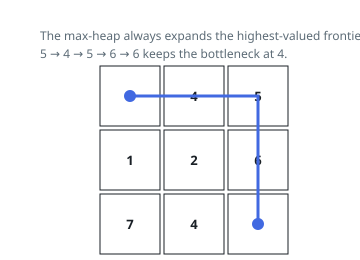

# Solutions — Path With Maximum Minimum Value

Two routes down the same fact: a walk is capped by its narrowest cell, so
the answer is the highest threshold at which the corners stay connected
through cells at least that valuable. The search grows a region best-first
and carries the running minimum to the far corner; the admission view
switches cells on biggest-first instead and stops the moment the corners
join one component — no walk is ever traced.

## Greedy Max-Heap Best-First Search

Maximizing the minimum cell along a path has optimal substructure for a best-first search: among all frontier candidates, stepping onto the highest-valued unvisited cell can never hurt, because that cell's value either raises the running minimum or leaves it unchanged, and any path to the goal through the frontier must pass through some frontier cell whose value is at most the one chosen. This is Dijkstra with max replacing min and the path cost being the running minimum — the first time the goal is popped, its recorded minimum is the best achievable.

The implementation drives a max-heap of negated cell values starting from the origin, whose value seeds the running best. Popping a cell updates best = min(best, cell value); reaching the bottom-right cell returns best immediately. Each expansion pushes the four cardinal neighbors that are in bounds and unvisited, marking them visited at push time so no cell enters the heap twice.

Greedy termination is what makes this correct and fast: by always expanding the most valuable frontier cell, the search reaches the goal along a path whose bottleneck is the maximum over all paths, without exploring by distance. Marking visited on push (not on pop) keeps the heap at most one entry per cell. Edge cases: a 1×1 grid returns the single cell's value on the first pop; the start cell's own value correctly caps the answer (e.g. an origin of 0 can never score above 0).

**Complexity:** `O(mn log(mn))` time, `O(mn)` space.

## Sorted Cell Admission with Union-Find

Stop tracing walks and watch connectivity instead. Admit cells into a
growing usable set in falling order of value and, after each admission,
ask whether the two corners have landed in the same component. Every cell
admitted so far carries a value at least that of the one just admitted, so
the first time the corners connect, the admitted cells hold a walk whose
bottleneck is exactly that last-admitted value — and nothing wider is
possible, since every cell of a wider walk would have been admitted
earlier and the corners would have joined sooner. This is the argument
Kruskal uses on minimum spanning trees, transplanted from edges to cells:
sorting by weight and uniting until the endpoints merge yields the maximum
bottleneck.

The code sorts all `mn` cells into falling order and runs a disjoint-set
forest over flattened indices `r * n + c`. One array does double duty:
`parent[i] == -1` while cell `i` still waits outside the set, so testing a
neighbour for admission and navigating the forest are the same lookup.
Admitting a cell makes it its own root and then merges it with each
already-admitted orthogonal neighbour; after every admission the roots of
the two corners are compared, and their first agreement returns the value
just admitted. Path halving inside `find` keeps the trees nearly flat, so
the merges cost little beside the sort that orders them.

Falling order makes ties honest too: equal values sit side by side in the
sorted run, and whichever of them closes the connection names the same
value. A 1 x 1 grid connects on the first admission and answers its lone
value; a walk that must cross a 0 still returns 0, since the corners
cannot connect at any value above it. On the first example the two
right-hand 9s and the 7 form the goal's island along the right column
while the 8 stands alone at the origin, and then the 6 lands between them,
welding the two islands together — 6 is returned the moment it admits.

**Complexity:** `O(mn log(mn))` time, `O(mn)` space.
