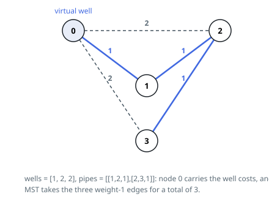

# Solutions — Optimize Water Distribution in a Village

"Build a source at site `i`" versus "link from a supplied neighbour" looks
like two different decisions, but both become edges in one graph: introduce
a virtual node 0 standing for supply itself, connect it to each site `i`
with weight `wells[i - 1]`, and keep the link edges as given. A site ends
up supplied exactly when it is connected to node 0 through the chosen edges,
so the cheapest plan is a minimum spanning tree over the `n + 1` nodes —
building a source is demoted to just another edge type. Two builders find
that tree here: Kruskal pools all the edges and sorts them once, while Prim
grows the tree straight out of node 0, one cheapest frontier edge at a
time.

## Minimum Spanning Tree with a Virtual Well Node

The choice "build a well at house i" or "pipe from a neighbor" can be unified into one graph problem: add a virtual node 0 representing the water source, connect it to each house `i` with an edge of weight `wells[i - 1]`, and keep the pipe edges as given. Every house is then supplied exactly when it is connected to node 0 in this augmented graph, and the cheapest such connection set is a minimum spanning tree on the `n + 1` nodes — building a well becomes just another edge type.

Kruskal's algorithm solves it: collect all edges (well edges plus pipe edges), sort by cost, and accept an edge whenever its endpoints are in different union-find components, using path-halving `find` to keep lookups cheap. Duplicate pipes between the same houses are harmless — the cheaper one is sorted first and merges the components, so the others get rejected by the same-roots check.

A spanning tree of `n + 1` nodes has exactly `n` edges, so the loop stops as soon as `used == n`; since the graph is connected by construction (node 0 touches every house), the full tree is always reachable and no failure case exists. The example with `wells = [1,2,2]` illustrates the mechanism: the cheap well edge to house 1 is taken first, and the two unit pipes then hang the remaining houses off it for a total of 3.

Writing `N` for the house count and `P` for the pipe count, sorting the combined `N + P` edge list dominates the running time; the union-find passes over it are near-linear.

**Complexity:** `O((N + P) log(N + P))` time, `O(N + P)` space.

## Prim Seeded from the Virtual Node

Kruskal orders every edge up front; Prim never sorts at all. The tree
starts at node 0 — supply itself, keyed 0 — and each step joins the
cheapest edge leading from the supplied region to a site still outside it.
The greedy choice is the same, only made locally: the heap holds the
frontier's candidates, never the whole edge set.

The code builds one adjacency list over the `n + 1` nodes — every link in
both directions, plus a source edge from node 0 to each site — and seeds a
min-heap of `(cost, site)` records with `(0, 0)`. A pop that lands on an
unsettled site joins it at that cost and scans its adjacency, and an edge
is pushed only when it strictly improves the site's recorded `best`. The
two guards together make parallel pipes a non-event: in Example 2 the
cost-3 and cost-1 pipes sit in the heap as rival candidates for site 2,
the cheaper one settles it, and the loser is skipped as stale.

Node 0 touches every site, so the frontier never starves: the count of
settled nodes climbs to `n + 1`, where the loop stops with the answer
already banked. For `wells = [4,3,5]` with pipes `[1,2,1]` and
`[1,3,2]`, the heap opens with the source edges 4, 3 and 5; 3 settles site
2, then the pipes at 1 and 2 pull in sites 1 and 3 — the same 6, found by
growing rather than by sorting.

Each of the `N + P` edges is scanned exactly once, from whichever endpoint
settles first, and at most one record per edge ever enters the heap: a
linear sweep carries the real work and the heap only adds its logarithmic
toll per edge.

**Complexity:** `O((N + P) log N)` time, `O(N + P)` space.
