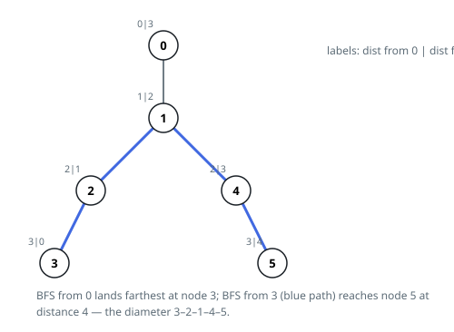

# Solutions — Tree Diameter

Both answers escape the same trap: measuring the route between every pair
of nodes would cost quadratic time, and neither needs to. The rooted sweep
pays in bookkeeping — hang the tree from any root and every path has a
highest turning node, so one bottom-up pass adding each node's two deepest
subtree heights finds the widest. The double sweep pays in theory instead:
a farthest-node theorem lets two breadth-first searches read the width
straight off, with no per-node accounting at all.

## Rooted DFS with top-two subtree heights

Hang the tree from any root — node 0 does — and every path acquires a
highest node, the one sitting closest to the root; the trip descends into
two different child subtrees on its way through. The widest path turning
at a node is therefore the sum of its two deepest child heights, and the
widest path in the whole tree is the largest such sum over all nodes.
Nothing is missed and nothing is counted twice — every path is scored
exactly once, at its own turning node.

The code runs one rooted traversal in two stack-driven passes. The first
walks from the root with an explicit stack, recording each node as it is
popped; each node is entered from exactly one neighbor — its parent,
remembered in `parent` — so the recorded order meets parents before
children. The second pass reads that order backwards, which gives exactly
the property post-order is prized for: every child's height is already
final when its parent reads it. `first` and `second` hold the two deepest
child heights at the current node; their sum challenges the record, and
`first` alone is handed up as the node's own height.

The explicit stack is the point: chains ten thousand nodes deep would
exhaust the call stack of a recursive post-order in some languages, while
the stack here holds at most `n` entries in ordinary arrays. `parent`
starts at `-1` everywhere, and `-1` is also the root's entry, so no
neighbor of node 0 is ever mistaken for its parent. The degenerate input —
one node, no edges — is settled up front with 0. Example 2 resolves at
node 0: its branches toward 2 and toward 3 each run two edges down, so
turning there joins 2 + 2 = 4 edges, and node 4's one-edge stub, neither
the deepest nor the second deepest branch, is left out of the record.

**Complexity:** `O(n)` time, `O(n)` space.

## Double BFS

The key insight is a classic tree property: starting a traversal from any node and finding the farthest node `B` guarantees that `B` is one endpoint of a longest path. A second traversal from `B` therefore measures the full diameter directly. Intuitively, wherever the true diameter's endpoints hide relative to the start node, the longest path from the start must reach at least one of them — otherwise the diameter path could be extended or improved through the branching structure.

Each traversal is a plain breadth-first search over the `n` nodes that records the distance of every node from the source; because a tree has exactly one path between any two nodes, BFS distances are true path lengths, and the node that was assigned the largest distance is the farthest one. The search tracks that node on the fly (`far`) rather than scanning the distance array afterwards. The first BFS from node 0 yields endpoint `B`, and the second BFS from `B` returns the eccentricity of `B`, which equals the diameter.

Both passes are iterative, using a queue, so deep or path-shaped trees cannot overflow the recursion stack. Distances initialized to `-1` double as the visited marker. The single-node tree (empty edge list) is handled up front: with no edges the diameter is 0.

**Complexity:** `O(n)` time, `O(n)` space.
