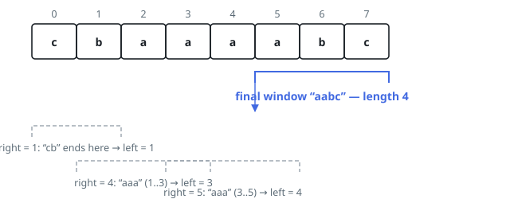

# Solutions — Length of the Longest Valid Substring

Both sweeps rest on the same pin: cleanliness is hereditary, so the longest
clean substring falls to a two-pointer sweep that grows the right end and,
whenever a forbidden string ends there, hops the left end past that string's
first character. The window variant finds each such occurrence by force,
probing a hash set with the up-to-`L` suffixes that end at the right end. The
automaton compiles the forbidden strings once into an Aho-Corasick machine
whose state after each character is the longest suffix of the text that
prefixes a forbidden string, so the occurrence search collapses to one hop
per character.

## Sliding Window with a Forbidden Set

Validity is hereditary — shrinking a valid window keeps it valid — so the longest valid substring fits a two-pointer sweep: advance `right` one character at a time and, whenever a forbidden string now ends at `right`, jump `left` past its start. Because every forbidden string has length at most `L = 10`, only the last `L` suffixes ending at `right` can possibly be forbidden, and a hash set of the forbidden strings answers each membership test in time proportional to the slice length.

For each new `right` the code tests those suffixes shortest-first and moves `left` to `j + 1` at the first match. Taking the shortest matching suffix — the one with the latest start — is the binding choice: it yields the largest window start that excludes every forbidden occurrence, since a longer match beginning further left is simply not contained in the resulting window. Occurrences that ended earlier were already excluded when the pointer passed their end, and `left` only ever moves right.

After each adjustment the candidate `right - left + 1` updates the answer. With `F` forbidden strings of length at most `L`, the sweep does at most `L` set lookups of length at most `L` per position, and storing the set costs the total size of the forbidden list.

**Complexity:** `O(n * L^2)` time, `O(F * L)` space.

## Aho-Corasick Longest-Match Scan

The forbidden strings are fixed before the scan begins, so they can be
compiled once into an Aho-Corasick automaton: a trie of the forbidden strings
whose failure links connect each node to the longest proper suffix of its
path that is also a trie path. The code keeps the trie's children in a single
map keyed by node and character, so the automaton costs one entry per trie
edge — its size tracks the forbidden text, not the alphabet. A breadth-first
pass over depth buckets wires the links; as it goes, every node folds in its
failure chain to learn the length of the shortest forbidden string ending
exactly there.

The scan then replays the two-pointer sweep with the per-position search
gone. Each character advances the state along the trie, falling back along
failure links when no child matches; the text pointer never retreats, and
since one character deepens the state by at most one while every fallback
shallows it, the fallbacks amortize to constant work per position. The
shortest forbidden string ending at the current right end is exactly the
latest-starting occurrence — the one the window variant's inner loop finds —
so hopping the left end past its first character performs the identical
jumps.

For `"zababars"` with `["za","aba"]` the left end hops to 1 after `"za"`, to
2 after the first `"aba"`, and to 4 after the second, just as before — but
each hop now costs one automaton step instead of a probe of the last `L`
suffixes.

Building the automaton touches each forbidden character once and the scan
touches each character of `word` once, with expected-constant map operations
throughout, so the window variant's `L`-squared probing term is gone.

**Complexity:** `O(n + F·L)` time, `O(F·L)` space.
