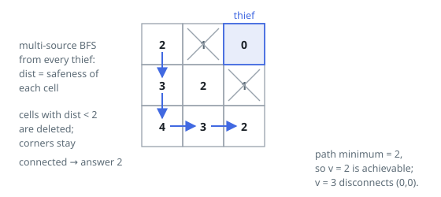

# Solutions — Find the Safest Path in a Grid

Both solutions rest on the same opening move: one multi-source BFS out of
every hazard at once fixes every cell's clearance, the lockstep wavefronts
reaching each cell along a shortest grid path. What differs is how the
corner-to-corner bottleneck is read out of that table. The binary search
leans on monotonicity — a route that survives one threshold survives any
lower one — and buys the answer with a logarithmic number of full-grid
reachability probes. The flood asks for no probes at all: cells walk in by
descending clearance, each uniting with its already-admitted neighbors, and
the moment the two corners land in one set, the clearance being admitted is
the answer.

## Multi-Source BFS with Binary Search

The key observation is that the safeness factor of any cell — its Manhattan distance to the nearest thief — can be computed for the whole grid at once by launching a single multi-source BFS from every thief cell simultaneously. Because BFS explores in waves, the first time the wavefront reaches a cell, it has traveled the minimum number of grid steps, which for this unweighted grid equals the Manhattan distance to the closest thief. This produces a `dist` table where `dist[r][c]` is exactly the safeness value of cell `(r, c)`.

A path from `(0, 0)` to `(n - 1, n - 1)` has safeness factor equal to the minimum `dist` value along it, so asking "is there a path with safeness factor at least `v`" is equivalent to asking whether the two corners stay connected when every cell with `dist < v` is deleted. That check is a plain BFS from `(0, 0)` restricted to cells with `dist >= v`, with an early exit if either endpoint itself falls below the threshold. Since the answer is monotone in `v` (a path valid for `v` is valid for any smaller threshold), the maximum factor is found by binary searching `v` over `[0, 2n]` — the largest possible distance in an `n x n` grid — keeping the largest threshold for which the reachability check succeeds.

Edge cases fall out naturally: a thief standing on either corner forces `dist` there to `0`, so no threshold above `0` can ever connect them and the answer is `0`. Both BFS passes are linear in the number of cells, and the binary search multiplies that by a logarithmic factor.

**Complexity:** `O(n^2 log n)` time, `O(n^2)` space.

## Descending-Clearance Kruskal Flood

The same `dist` table feeds a very different extraction. All `n²` cells are
sorted by clearance, descending, and admitted in that order into a
disjoint-set union: the moment a cell walks in it is united with each
already-admitted 4-neighbor, so at every instant the sets hold exactly the
connected components of the cells cleared so far. Watching the admission
stream is watching the threshold sweep unfold — every threshold's surviving
subgrid appears as a prefix of the order.

The merger of the two corners can only be witnessed at a value the answer
actually reaches: every union joins two 4-adjacent admitted cells, all
carrying clearance at least the value being admitted, so united corners
certify a genuine route of at least that strength, and the sweep can never
overreport. It never runs past the answer either — the best route's
bottleneck, its lowest-clearance cell, is the last of that route to walk
in, and its admission fuses the route end to end. The first merger
therefore happens while the value being admitted is the answer itself, and
that value is returned on the spot. Edge cases need no special code: a
hazard on either corner pins that corner's clearance at `0`, so the merger
waits for the final admissions and reports `0`.

Sorting the `n²` cells is the whole bill beyond the BFS. The admission pass
touches every cell and every grid edge once, with path halving and union
by size keeping each disjoint-set operation effectively constant, and the
`dist` table, the admission order, and the two union arrays are each
proportional to the cell count.

**Complexity:** `O(n² log n)` time, `O(n²)` space.
