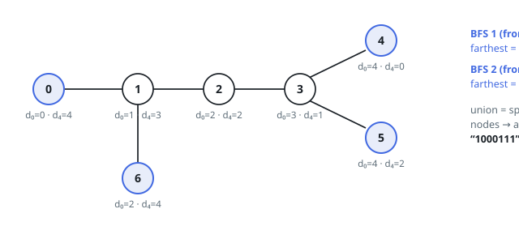

# Solutions — Find Diameter Endpoints of a Tree

Both methods stay linear by refusing to measure paths directly — each keeps
the right distances and lets the marking fall out. The double BFS leans on a
graph fact: sweep from any start and the farthest set collected is one side's
diameter ends, so two sweeps from lucky sources cover both sides. The
rerooting DP roots the tree once and works out every node's eccentricity — a
down pass for the heights below each node, an up pass for the escape through
its parent — then marks where that eccentricity equals the diameter; heavier
bookkeeping, but it answers for every node at once instead of two hand-picked
sources.

## Double BFS

The solution rests on a classic tree property: run a BFS from any starting node, and every node that ties as farthest from it is an endpoint of some diameter path. So the first BFS, started from node 0, collects the entire set of farthest nodes rather than a single one — each of them is a legitimate diameter endpoint lying on the "far side" of the tree relative to the start. Ties must be kept, because a tree with several equal-length arms has several diameter endpoints on that side.

A second BFS is then run from any node `u` in that first set. Since `u` is itself a diameter endpoint, the maximum distance recorded in this sweep equals the diameter `D`, and every node at distance exactly `D` from `u` is the opposite endpoint of a diameter path. The union of the two endpoint sets — the farthest nodes from the arbitrary start and the farthest nodes from `u` — is exactly the set of special nodes, which is rendered as the required binary string.

Concretely, the code builds an adjacency list, then uses a list as a FIFO queue for each BFS, recording distances in a `dist` array and tracking the largest distance seen. The helper returns the set of all indices whose distance equals that maximum, which naturally handles every tie. Each node is enqueued exactly once per sweep.

The edge cases fall out of the same mechanism: for `n = 2` both nodes are farthest in both sweeps and both come out special, and star-like or multi-armed trees produce multi-node sets on either sweep, all of which are unioned before producing the answer.

**Complexity:** `O(n)` time, `O(n)` space.

## Rerooting Eccentricity DP

A node terminates a diameter exactly when nothing sits farther from it than
the diameter's own length — when its eccentricity `ecc(v)` equals the tree's
maximum `D`. So the method computes every eccentricity in one rooted pass and
marks the nodes that tie the maximum.

The tree is rooted at node `0` and swept once for a BFS order with parents;
the order lets both passes run iteratively, parents before children one way
and children before parents the other, so recursion depth never bites at
`n = 10^5`. The down pass walks the order backwards, filling `down[v]` — the
height of `v`'s subtree — from each child's final value; riding along, every
parent keeps its top two child chains and which child owns the best. The up
pass walks forward: `up[v]` is the longest path leaving `v`'s subtree through
its parent, one edge plus the better of the parent's upward reach and its best
sibling arm. Here the second-best chain earns its keep — when `v` itself owns
the parent's best arm, the route into that arm is blocked at `v`'s own
subtree, and the sibling arm must stand in. With `ecc(v) = max(down[v],
up[v])` covering both directions, the marked nodes are exactly those whose
eccentricity equals the running maximum.

Example 2's tree shows the machinery paying off: node `5` has `down = 1` but
`up = 3`, its longest escape running through the center, so its eccentricity
of `3` falls short of `D = 4` while leaves `0`, `2`, `3`, and `4` all tie the
maximum. Unlike the two sweeps — which only ever see distances from two chosen
sources — this pass knows every node's farthest distance, at the price of the
extra top-two and parent bookkeeping.

**Complexity:** `O(n)` time, `O(n)` space.
