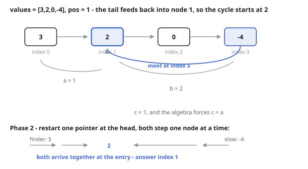

# Solutions — Linked List Cycle II

## Floyd's Algorithm with Entry Walk

As in the detection variant, the wire-form input is materialized first: build the nodes from `values`, link them, and connect the tail back to index pos when pos is not -1. Phase one is the standard tortoise-and-hare scan from the head; if fast falls off the end there is no cycle and the answer is -1.

When the pointers meet, write a for the distance from head to cycle entry, b for entry to meeting point, and c for the rest of the loop from meeting point back to entry. Slow has walked a + b while fast has walked twice as far; fast's surplus is whole laps, in the simplest form a + 2b + c = 2(a + b), which simplifies to c = a. So a pointer restarted at the head and slow restarted at the meeting point, each advancing one step at a time, converge after exactly a steps — right on the entry node.

Because the judge wants an index rather than a node reference, the code then walks from the head counting steps until it reaches that node; the count is the 0-based index of the cycle's first node within `values`. All three phases are linear, and the only sizable storage is the O(n) node array built from the wire input — the detection itself uses two pointers, satisfying the follow-up's constant-memory bound.

**Complexity:** `O(n)` time, `O(n)` space.
