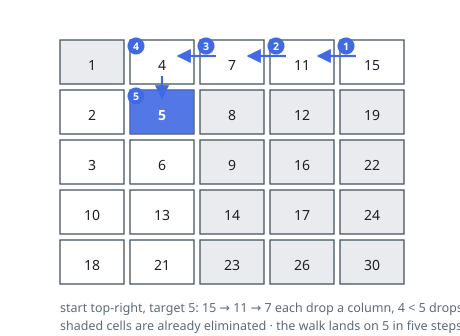

# Solutions — Search a 2D Matrix II

## Staircase Search from the Top-Right Corner

Rows sorted left to right and columns sorted top to bottom do not make the matrix globally sorted, so a single binary search cannot work. But the corners are special: the top-right element is simultaneously the largest in its row and the smallest in its column, so comparing it against the target eliminates an entire row or an entire column in one step. (The bottom-left corner is symmetric; the top-left and bottom-right corners only ever eliminate half-spaces that don't decompose this way.)

Starting at the top-right, if the current value exceeds the target, everything below it in its column is even larger, so the whole column is discarded by moving left; if the current value is smaller than the target, everything to its left in its row is even smaller, so the whole row is discarded by moving down. Each step therefore removes one row or one column from the still-plausible region, and the walk terminates either at the target or by falling off the left or bottom edge, proving absence.

The path is a monotone staircase of at most `m + n - 1` steps — compare with binary-searching all `m` rows at `O(m log n)`, which is strictly worse whenever the matrix is roughly square. An empty matrix or empty rows are guarded up front; the search itself needs only two index variables.

**Complexity:** `O(m + n)` time, `O(1)` space.
